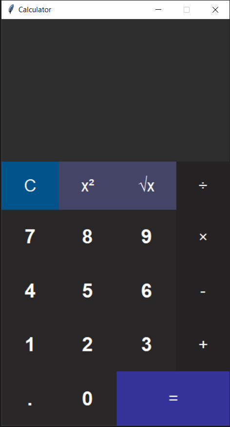

# 🖩 Simple Calculator (Python + Tkinter, Dark Mode)

A clean, dark-mode **GUI calculator** built with **Python** and **Tkinter**.  
Supports basic arithmetic along with **square (x²)** and **square root (√x)**.



---

## ✨ Features
- Dark theme UI
- Operators: `+  -  ×  ÷`
- Special: `x²`, `√x`, and `C` (clear)
- Keyboard: press `Enter` to evaluate

---

## ▶️ Run Locally

```bash
# 1) Clone the repo
git clone https://github.com/Ch-M-Saad/simple-calculator-gui.git
cd simple-calculator-gui

# 2) Run
python calculator.py


